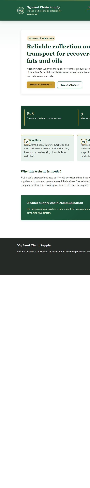
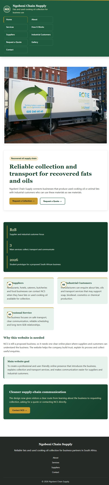
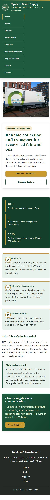
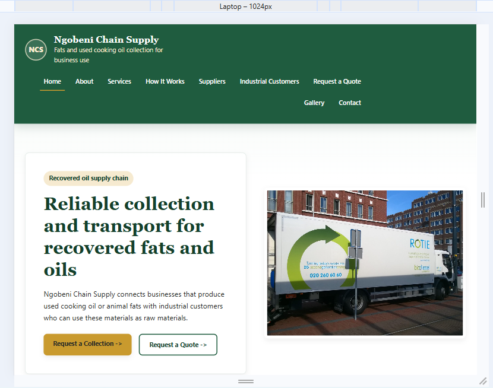

# Ngobeni Chain Supply Website

This is my WEDE5020 website project for Ngobeni Chain Supply. The website is
an HTML5/CSS3 prototype for a proposed South African business that collects
and transports used cooking oil and animal fats for business customers.

## Project Purpose

The purpose of the website is to give Ngobeni Chain Supply a professional
online presence. It explains the business, its services, how the collection
process works, and gives suppliers and industrial customers a way to make
enquiries.

## Website Pages

- `index.html` - Home page
- `pages/about.html` - About the business
- `pages/services.html` - Services offered
- `pages/how-it-works.html` - Collection and transport process
- `pages/suppliers.html` - Supplier collection request page
- `pages/industrial-customers.html` - Information for industrial customers
- `pages/quote.html` - Quote request form
- `pages/gallery.html` - Image gallery
- `pages/contact.html` - Contact details and contact form

## Folder Structure

```text
ngobeni-chain-supply/
  index.html
  README.md
  CHANGELOG.md
  assets/
    css/
      styles.css
    images/
      biodiesel-industrial-process.jpg
      biodiesel-oil-collection-can.jpg
      oil-collection-lorry.jpg
      oil-recycling-container.jpg
  docs/
    screenshots/
      desktop-home.png
      tablet-home.png
      mobile-home.png
  pages/
    about.html
    contact.html
    gallery.html
    how-it-works.html
    industrial-customers.html
    quote.html
    services.html
    suppliers.html
```

## Technologies Used

- HTML5 for the website pages and content structure
- CSS3 for the colours, layout, spacing and responsive design
- Visual Studio Code for writing and editing the code
- Google Chrome or Microsoft Edge for testing the website
- Git and GitHub for version control evidence

## Part 1 Requirements Covered

- Logical file and folder structure
- Multiple linked HTML pages
- Semantic HTML elements like `header`, `nav`, `main`, `section`, `article`,
  `form` and `footer`
- Working navigation on all pages
- Meaningful business content based on the proposal
- Helpful HTML and CSS comments
- Image assets with references
- README, changelog and references documentation

## Part 2 Requirements Covered

- **One external stylesheet** (`assets/css/styles.css`) linked from every
  HTML page.
- **CSS reset and base style** for consistent rendering across browsers
  (`* { box-sizing: border-box; margin: 0; padding: 0; }`, base
  `font-family`, `font-size`, `line-height` and colours set on `body`).
- **Typography scale** using `rem` values for `font-family`, `font-size`,
  `font-weight`, `line-height` and `letter-spacing` on headings and body
  text.
- **Layout structure** built with a mix of **CSS Grid** (`.grid`, `.grid.two`,
  `.hero`, `.gallery-grid`, `.steps`, `.footer-grid`) and **Flexbox**
  (`.site-header`, `.nav-list`, `.button-row`), using `display`,
  `grid-template-columns`, `flex-direction`, `justify-content` and
  `align-items` to keep the number of selectors to a minimum by reusing
  the same utility classes across pages.
- **Visual styling** with `color`, `background-color`, `border` and
  `box-shadow`, plus an improved hero section, branded NCS badge,
  highlight strip, numbered feature cards and a call-to-action section.
- **Navigation polish**: the main navigation is consistent on every page,
  uses a clear active-page state, and changes from a desktop Flexbox layout
  to tablet/mobile grid layouts.
- **Interactive states** using `:hover`, `:focus-visible` and `:active` on
  navigation links, buttons, cards and form fields.
- **Responsive design** with two breakpoints (tablet `900px` and mobile
  `600px`) implemented with `@media` queries. On smaller screens the
  navigation stacks vertically, multi-column grids collapse to a single
  column, and heading sizes reduce.
- **Relative units**: `rem`/`em` for spacing, font sizes and breakpoints,
  and `%`/`fr` for widths so the layout scales rather than using fixed
  pixel values.
- **Responsive images**: images use `max-width: 100%; height: auto;` so
  they scale fluidly inside their grid columns at every screen size. The
  gallery images additionally use `aspect-ratio` and `object-fit: cover`
  for a consistent, cropped display.
- Continuous testing with browser developer tools at desktop, tablet and
  mobile widths (see screenshot evidence in the submission).

## Responsive Testing Evidence

The website was tested using the browser viewport at desktop, tablet and
mobile widths. The checks confirmed that there is no horizontal overflow and
that the layout changes at the intended breakpoints.

### Desktop View - 1440px



### Tablet View - 768px



### Mobile View - 390px



### Laptop View - 1024px


## Changelog

### 2026-09-15 - Part 2 CSS and responsive design

- Corrected Part 1 presentation issues by removing duplicated CSS reset
  styles, making the footer navigation consistent on inner pages and updating
  the README folder structure so it matches the actual project files.
- Improved the visual identity with a stronger green, gold, white and
  charcoal style, a branded NCS badge, styled hero panel, highlight strip,
  numbered feature cards and a homepage call-to-action band.
- Added responsive tablet and mobile navigation layouts using media queries,
  CSS Grid and Flexbox.
- Added stable responsive image rules using `max-width`, `aspect-ratio` and
  `object-fit` so images resize without overflowing.
- Added desktop, tablet and mobile screenshot evidence in `docs/screenshots/`.

### 2026-08-14 - Part 1 website structure

- Created the main project folder and organised subfolders for pages, CSS,
  images and documentation.
- Built the home page with a clear introduction, call-to-action buttons and
  service summary cards.
- Added About, Services, How It Works, Suppliers, Industrial Customers,
  Quote, Gallery and Contact pages.
- Added consistent navigation to every page.
- Added forms for supplier collection requests, quote requests and contact
  enquiries.
- Added a shared CSS stylesheet with the proposed green, white, charcoal and
  gold colour style.
- Replaced placeholder illustrations with realistic images related to oil
  collection, recycling and biodiesel processing.
- Added README and changelog documentation.

## References

- WEDE5020 CSS Slides Part 2. Lecture material covering CSS layout, Flexbox,
  Grid, responsive design, media queries, forms and interaction polish.
- WEDE5020 Week 7 Slides. Lecture material covering HTML, CSS and responsive
  design concepts.
- Wikimedia Commons image sources were used for the website prototype images.

## How to Open the Website

Open the project folder in Visual Studio Code. Then open `index.html` in a
browser. From the home page, use the navigation menu to test every page
link, and resize the browser window (or use developer tools' device
toolbar) to test the responsive layout.
